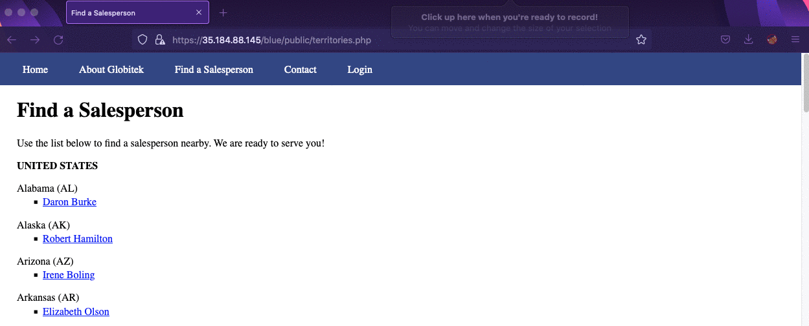
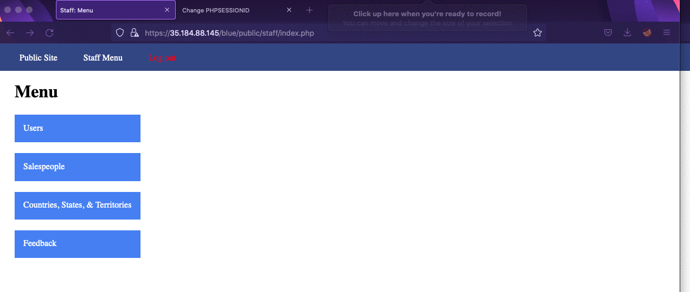
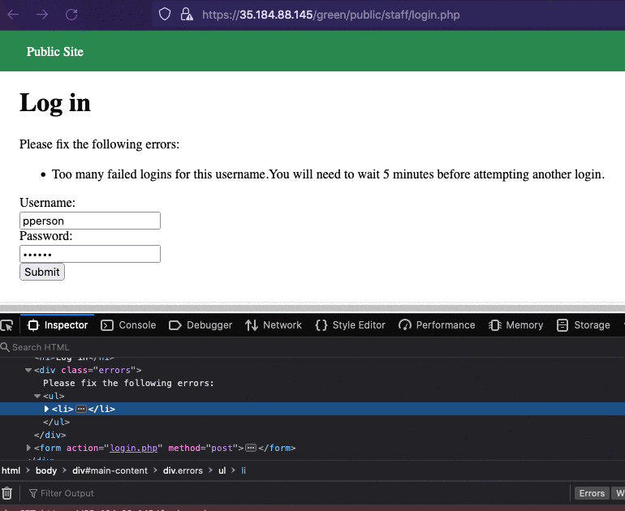
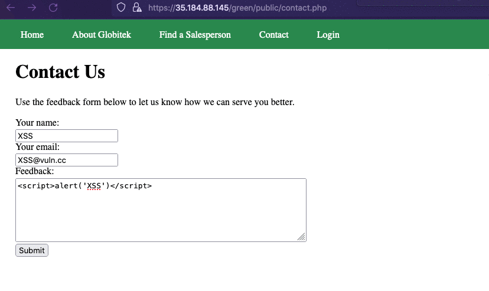
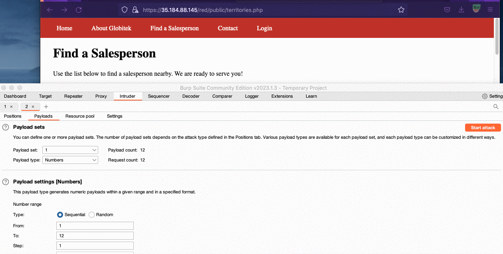

# Pen Testing Live Targets

Time spent: **X** hours spent in total

> Objective: Identify vulnerabilities in three different versions of the Globitek website: blue, green, and red.

The six possible exploits are:

* Username Enumeration
* Insecure Direct Object Reference (IDOR)
* SQL Injection (SQLi)
* Cross-Site Scripting (XSS)
* Cross-Site Request Forgery (CSRF)
* Session Hijacking/Fixation

Each color is vulnerable to only 2 of the 6 possible exploits. First discover which color has the specific vulnerability, then write a short description of how to exploit it, and finally demonstrate it using screenshots compiled into a GIF.

## Blue

Vulnerability #1: SQL Injecion (SQLi)

Description: The hacker visits the sales person 
Robert Hamilton ```/public/salesperson.php?id=4``` and injects this specific SQL into the URL
```/public/salesperson.php?id=%27or%201=1--%27``` The URL returns the sales person Daron Burke.



Vulnerability #2: Session Hijacking/Fixation

Description: The victim Logs in to the website as the administrator, The hacker captures the administrator's session ID and logins into the administrator's account with the stolen session ID.




## Green

Vulnerability #1: Username Enumeration

Description:
When a hacker enters a correct username, they inspect the element of the username and find the ```class=failure``` element. If the username does not exist in the website, then the inspect of the username will return ```class=failed```. For example, the pperson username exists in the website but the ppersons username does not exist.



Vulnerability #2: Cross-Site Scripting (XSS)

Description:
The hacker takes advantage of a cross-site scripting vulnerablility in the contact form.
When the administrator logs in, and visits the feedback page, they are attacked by a cross-site script.



## Red

Vulnerability #1: Insecure Direct Object Reference (IDOR)

Description:
This link ```/red/public/salesperson.php?id=``` is vulnerable to Insecure Direct Object Reference.
The hacker uses the burp suite tool to find the hidden users. Inside burp suite, the hacker loads a scope of the red websites IP address, and sets a numbers payload in sequential order from 1 to 12 with a step of 1. When the attack starts, status code 200 indicates that a salesperson has been found. A status code 302 means that there is no salesperson found. In total there is 11 salesperson found by the attack. The attack exposes two new salesperson found by the attack.



Vulnerability #2: Cross-Site Request Forgery (CSRF)

Description:
This site is not configured correctly for CSRF protection. A hacker can submit a hidden form
in the feedback page that alters the salesperson's information. When the site is configured propertly, this action is only for the administrator. In my demostration video, I show how to change information of Elizabeth Olson to Elizabeth Suzuki. When the Administrator follows the link, they submit the bad form. 
```
<html>
    <head>
        <title>FAKE FORM</title>
    </head>
  <body onload="document.form.submit()">
    <form action="https://35.184.88.145/red/public/staff/salespeople/edit.php?id=6" method="POST" name="form" style="display: none;" target="hidden_results" >
      <input type="text" name="first_name" value="Elizabeth" />
      <input type="text" name="last_name" value="Suzuki" />
      <input type="text" name="phone" value="555-352-9604" />
      <input type="text" name="email" value="suzuki@salesperson.com" />
    </form>
    <iframe name="hidden_results" style="display:   none;" ></iframe>
  </body>
</html>

```


## Notes

Describe any challenges encountered while doing the work

